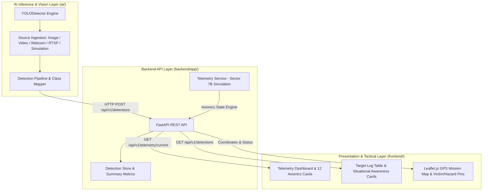

# SkyResQ System Architecture & Design Specification

SkyResQ is a modular, AI-powered aerial rescue and situational awareness platform designed for disaster response, casualty localization, and hazard monitoring.

---

## 1. High-Level Subsystem Architecture

The platform follows a decoupled, service-oriented architecture divided into four primary tiers:



---

## 2. Directory Structure

```
SkyResQ/
├── ai/                              # Modular AI Detection Package
│   ├── config/
│   │   ├── __init__.py
│   │   └── settings.py              # Thresholds, target mappings, API endpoints
│   ├── models/
│   │   └── README.md                # Guide for .pt / ONNX model weight files
│   ├── detection/
│   │   ├── __init__.py
│   │   ├── yolo_detector.py         # Multi-input YOLO detector engine
│   │   └── pipeline.py              # Ingestion runner streaming detections to FastAPI
│   ├── tests/
│   │   ├── __init__.py
│   │   └── test_yolo_detection.py   # Unit test suite
│   └── __init__.py
│
├── backend/                         # FastAPI Backend Service
│   ├── app/
│   │   ├── api/
│   │   │   ├── telemetry.py         # /api/v1/telemetry/current, /status
│   │   │   └── detections.py        # /api/v1/detections (GET, POST, DELETE), /summary, /latest
│   │   ├── models/
│   │   │   ├── telemetry.py         # Pydantic schemas for avionics & diagnostics
│   │   │   └── detection.py         # Pydantic schemas for BoundingBox, DetectionCreate/Response
│   │   ├── services/
│   │   │   ├── telemetry_service.py # Procedural Sector 7B flight simulation
│   │   │   └── detection_service.py # Thread-safe detection store & summary calculator
│   │   └── main.py                  # App entrypoint, CORS middleware, route mounts
│   ├── examples/
│   │   └── yolo_client_example.py   # Zero-dependency Python client script
│   └── requirements.txt             # FastAPI, Pydantic, Uvicorn dependencies
│
├── frontend/                        # Web Dashboard & Tactical Map
│   ├── index.html                   # Tactical HTML5 layout
│   ├── app.js                       # Telemetry polling, Leaflet map manager, detection rendering
│   ├── style.css                    # Dark glassmorphic tactical avionics theme
│   └── assets/                      # SVGs for drone, victim pins, and hazard markers
│
├── docs/                            # System Documentation
│   ├── ARCHITECTURE.md              # This architecture specification
│   └── AI_INTEGRATION.md            # Step-by-step YOLO integration manual
│
└── README.md                        # Master project documentation
```

---

## 3. Data Flow & Integration Patterns

### 3.1 AI Vision Ingestion Pipeline
1. **Source Capture**: Frame is obtained via static image, video file, live webcam device, or RTSP camera stream.
2. **Inference Execution**: `YOLODetector` executes YOLOv8 model inference or falls back to the deterministic synthetic generator.
3. **Class Normalization**: Raw COCO labels are mapped into standardized SkyResQ SAR categories (`person`, `vehicle`, `fire`, `hazard`, `other`).
4. **Georeference Verification**: Geodetic coordinates are mapped strictly if sensor georeferencing is available; otherwise, coordinates are explicitly flagged as `"GPS Unavailable"`.
5. **REST Transmission**: `POST /api/v1/detections` streams verified records into the backend with assigned detection IDs (`DET-LIVE-xxx` or `DET-SIM-xxx`).

### 3.2 Telemetry Engine
* Simulates dynamic search patterns across Mount Wilson / Sector 7B with realistic velocity, heading changes, altitude variations, and LiPo battery drain.
* Exposes avionics at `1.0 Hz` via `GET /api/v1/telemetry/current`.

### 3.3 Dashboard Synchronization
* Asynchronous 1-second polling (`Promise.all`) updates avionics cards, tactical HUD, and target logs simultaneously.
* Detections with coordinates trigger interactive Leaflet map markers with popups displaying target class, confidence, coordinates, and operational status.
